# Apache Web Server Log Analysis

## SOC Analyst Project | Apache Log Monitoring | Threat Detection | MITRE ATT&CK Mapping


---

# Project Overview

This project demonstrates practical Security Operations Center (SOC) analyst skills through the investigation of Apache web server logs on Ubuntu Linux.

Using Apache access logs and error logs, web traffic was analyzed to identify request patterns, investigate HTTP 404 responses, review server operational events, and document security-relevant findings.

The project simulates real-world Blue Team activities including:

* Log Analysis
* Security Monitoring
* Threat Detection
* Event Investigation
* MITRE ATT&CK Mapping
* Incident Documentation
* Security Reporting

---

# Project Objectives

* Install and configure Apache Web Server
* Generate and analyze web traffic
* Investigate Apache access logs
* Review Apache error logs
* Identify failed requests
* Analyze source IP activity
* Detect reconnaissance indicators
* Map findings to MITRE ATT&CK
* Produce professional security documentation

---

# Skills Demonstrated

### Security Operations

* Log Analysis
* Security Monitoring
* Threat Detection
* Event Investigation
* IOC Identification
* Security Reporting

### Linux Administration

* Ubuntu Administration
* Apache Web Server Management
* Service Monitoring
* Log Management

### SOC Analyst Competencies

* Incident Investigation
* Threat Hunting Fundamentals
* MITRE ATT&CK Mapping
* Security Documentation
* Web Server Monitoring

---

# Lab Environment

| Component        | Details                     |
| ---------------- | --------------------------- |
| Operating System | Ubuntu Linux                |
| Web Server       | Apache2                     |
| Log Sources      | access.log, error.log       |
| Log Location     | /var/log/apache2            |
| Analysis Tools   | grep, awk, less, sort, uniq |
| Analyst Role     | SOC Analyst                 |

---

# Project Architecture

```text
User Requests
      │
      ▼
Apache Web Server
      │
      ▼
Apache Access Logs
Apache Error Logs
      │
      ▼
Linux Log Analysis Tools
      │
      ▼
Security Findings
      │
      ▼
Incident Report
```

---

# Project Walkthrough

## Step 1 – Update Ubuntu

Apache prerequisites were installed and package repositories updated.

### Screenshot

```text
screenshots/01-ubuntu-update.png
```

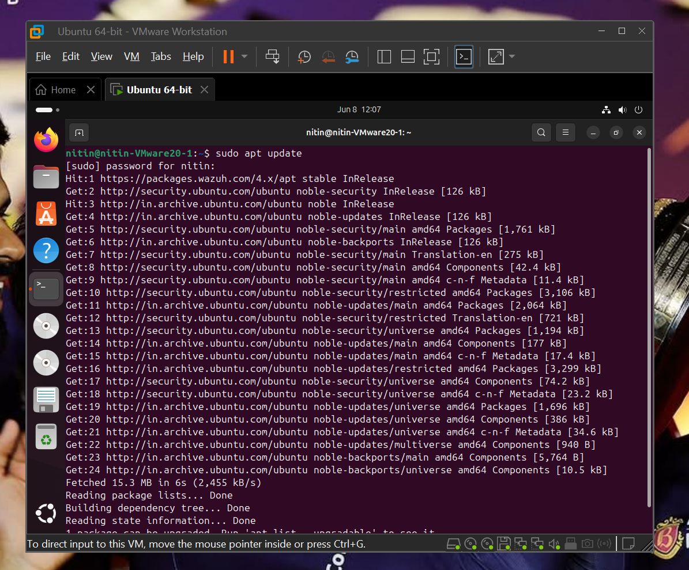

---

## Step 2 – Install Apache

Apache Web Server was installed successfully.

### Screenshot

```text
screenshots/02-apache-installed.png
```

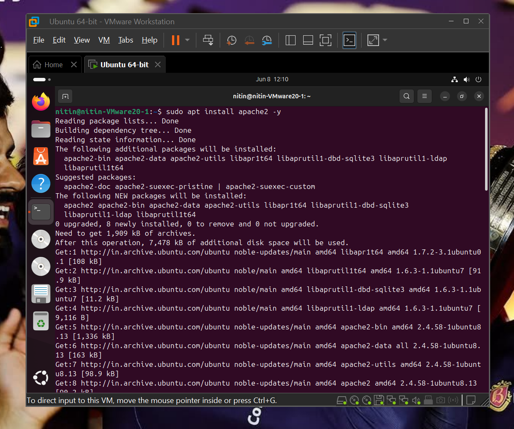

---

## Step 3 – Enable Apache Service

Apache was configured to start automatically during system boot.

### Screenshot

```text
screenshots/03-apache-enabled.png
```

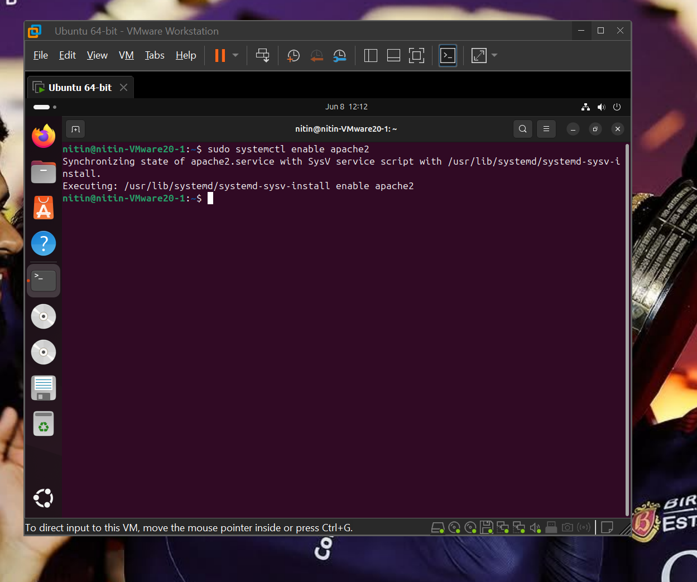

---

## Step 4 – Verify Apache Status

Service verification confirmed Apache was running successfully.

### Screenshot

```text
screenshots/04-apache-running.png
```

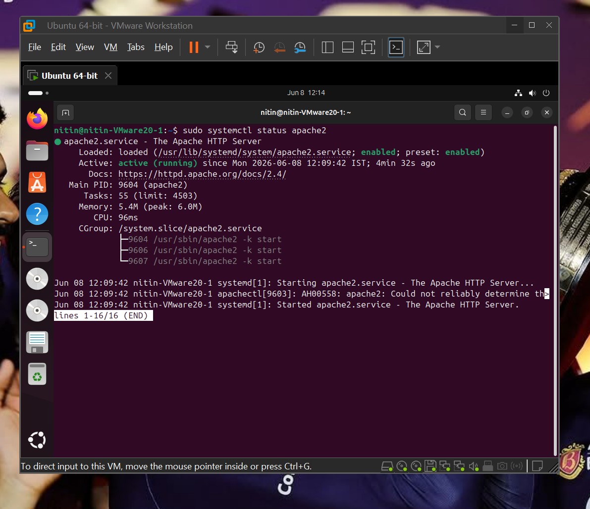

---

## Step 5 – Access Apache Default Page

The Apache default web page confirmed successful deployment.

### Screenshot

```text
screenshots/05-apache-default-page.png
```


---

## Step 6 – Access Apache Logs

The Apache log directory was reviewed.

### Screenshot

```text
screenshots/06-log-files-list.png
```

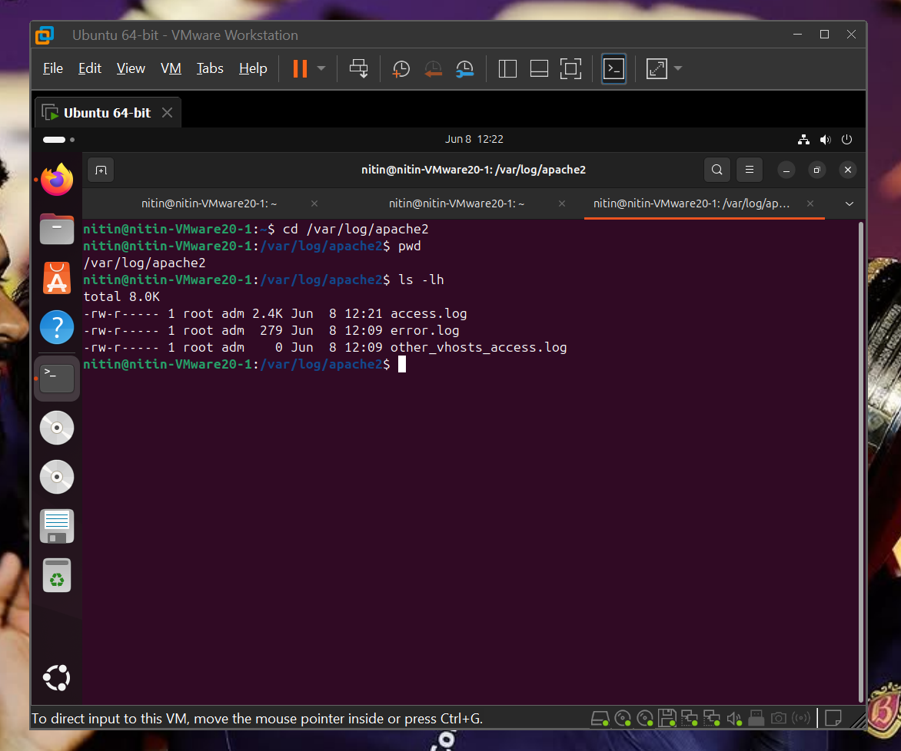

---

## Step 7 – Analyze Access Logs

Apache access logs were inspected to understand request activity.

### Screenshot

```text
screenshots/07-access-log-view.png
```

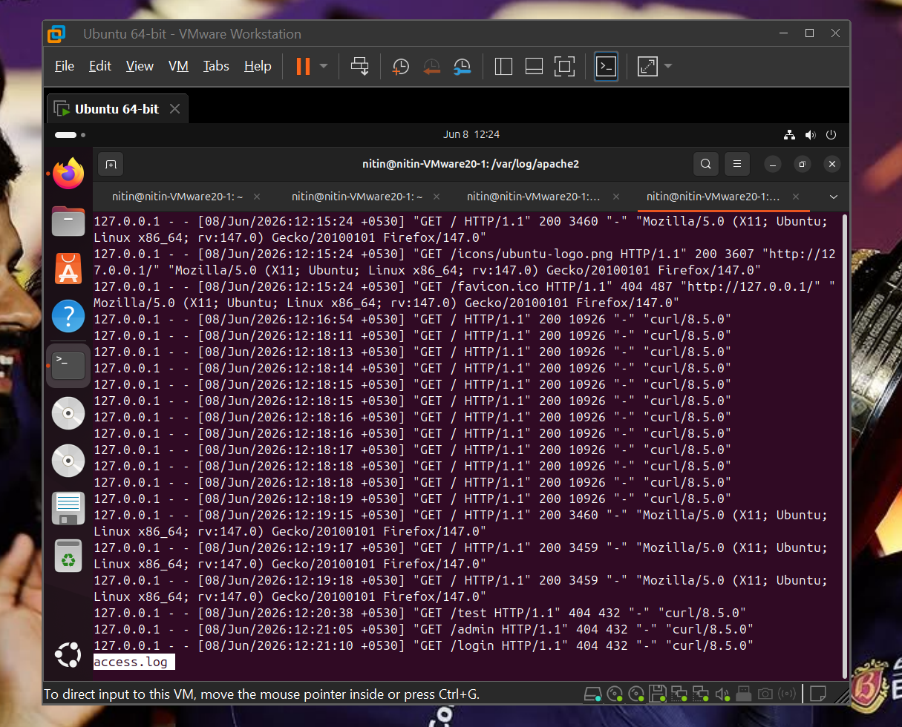

---

## Step 8 – Investigate HTTP 404 Responses

Several invalid URLs were intentionally requested to generate log events.

Observed URLs:

```text
/admin
/login
/test
/secret
```

### Screenshot

```text
screenshots/08-404-errors.png
```

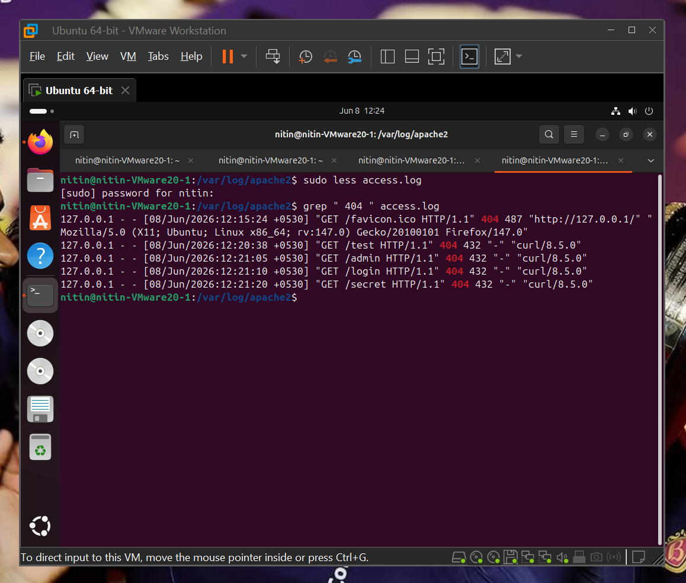

---

## Step 9 – Identify Top Source IP

Source IP frequency analysis was performed.

Result:

```text
127.0.0.1
```

### Screenshot

```text
screenshots/09-top-ip-addresses.png
```

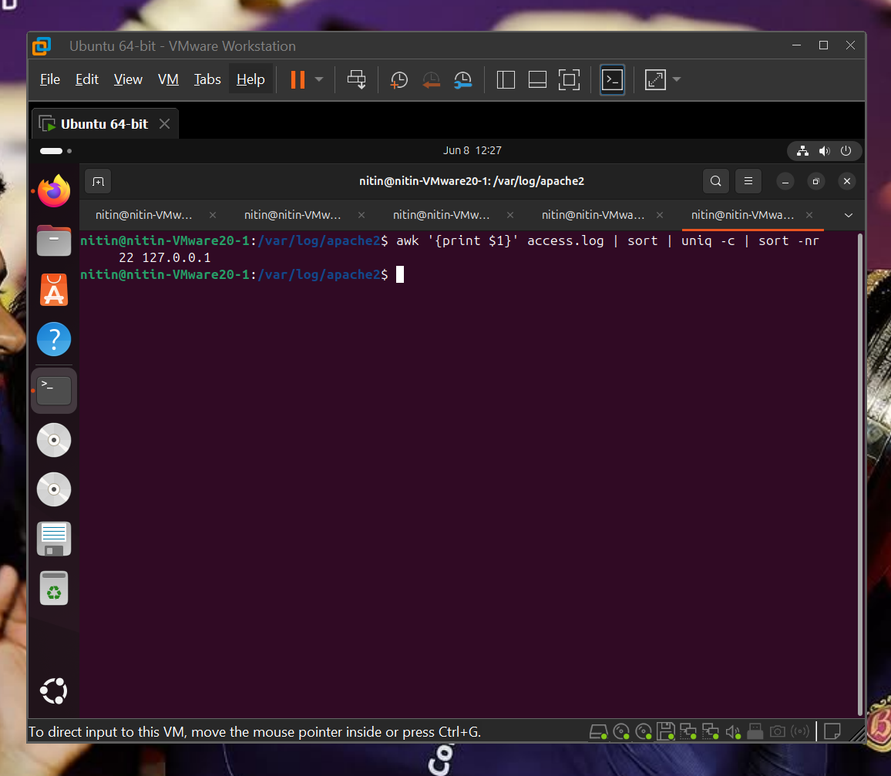

---

## Step 10 – Identify Most Requested URLs

Most frequently accessed resources were identified.

### Screenshot

```text
screenshots/10-most-requested-urls.png
```

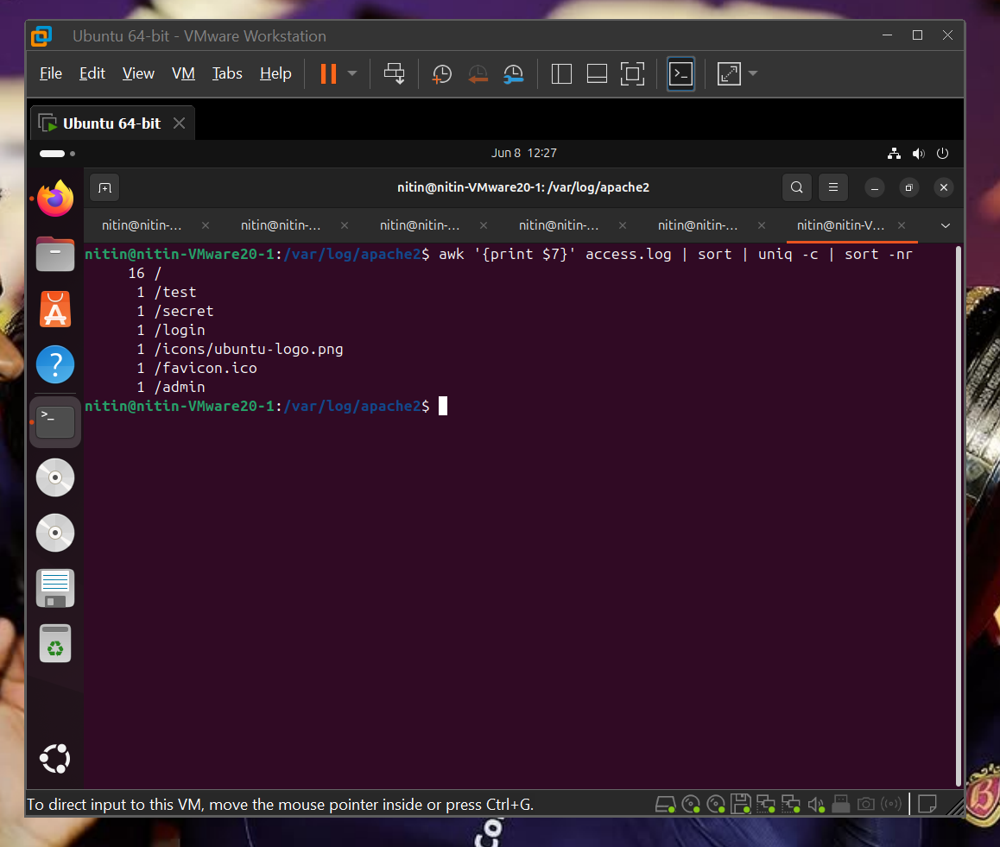

---

## Step 11 – Review Error Logs

Apache error logs were examined for failures and anomalies.

### Screenshot

```text
screenshots/11-error-log-analysis.png
```

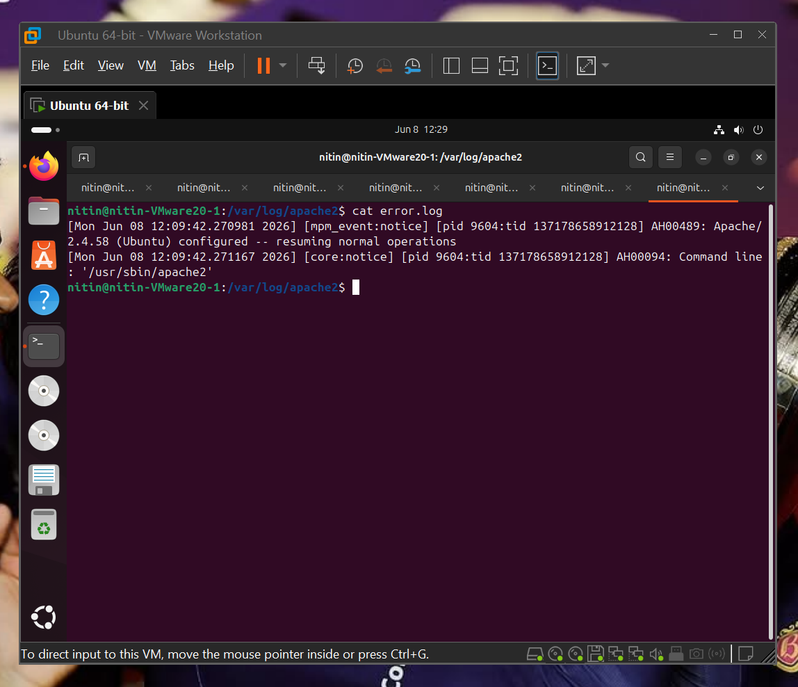

---

## Step 12 – Count HTTP 404 Errors

Total failed requests were calculated.

Result:

```text
5
```

### Screenshot

```text
screenshots/12-total-404-count.png
```

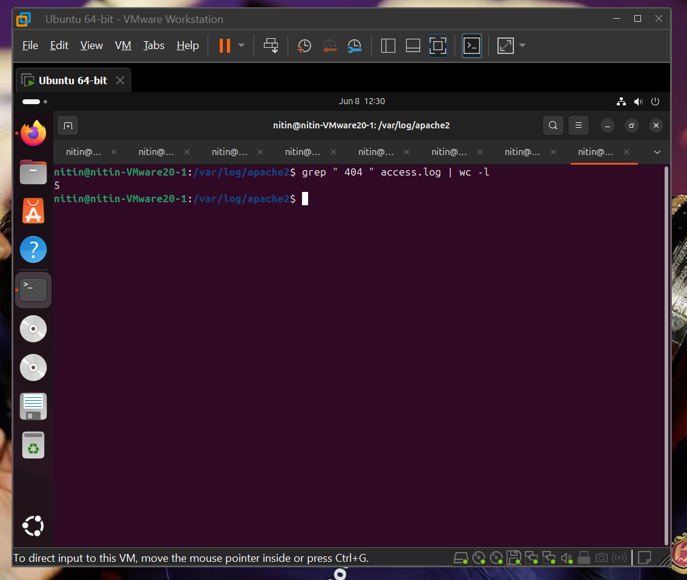

---

## Step 13 – Document Security Findings

Investigation findings were documented.

### Screenshot

```text
screenshots/13-security-findings.png
```

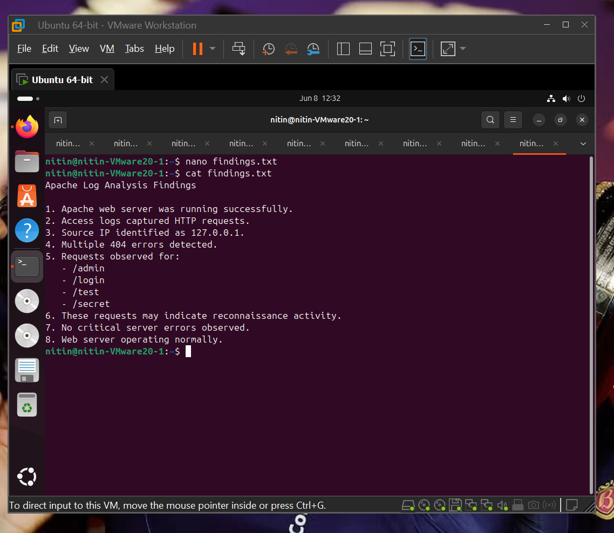

---

# Key Findings

| Finding                  | Result    |
| ------------------------ | --------- |
| Apache Running           | Yes       |
| Access Logs Available    | Yes       |
| Error Logs Available     | Yes       |
| Top Source IP            | 127.0.0.1 |
| Total Requests           | 22        |
| Total 404 Errors         | 5         |
| Critical Errors Found    | No        |
| Suspicious URLs Observed | Yes       |

---

# MITRE ATT&CK Mapping

| Tactic               | Technique                         | ID    |
| -------------------- | --------------------------------- | ----- |
| Reconnaissance       | Active Scanning                   | T1595 |
| Reconnaissance       | Gather Victim Network Information | T1590 |
| Discovery            | File and Directory Discovery      | T1083 |
| Discovery            | System Information Discovery      | T1082 |
| Resource Development | Infrastructure Enumeration        | T1580 |

## Observed Activity

The following requests resemble reconnaissance techniques commonly observed during web application assessments:

```text
/admin
/login
/test
/secret
```

These requests may indicate:

* Directory Enumeration
* Administrative Panel Discovery
* Attack Surface Mapping
* Automated Scanning Activity

---

# Security Recommendations

### Monitoring

* Continuously review Apache logs
* Monitor repeated 404 errors
* Investigate abnormal request patterns

### Detection

* Configure SIEM alerts
* Detect repeated administrative page requests
* Alert on unusual request spikes

### Hardening

* Restrict administrative endpoints
* Enable centralized logging
* Deploy a Web Application Firewall (WAF)

---

# Documentation

### Findings

* findings/Security-Findings.md
* findings/Log-Analysis-Summary.md

### Commands

* commands/log-analysis-commands.txt

### Report

* report/Apache-Web-Server-Log-Analysis-Report.pdf

---

# Learning Outcomes

Through this project, I gained hands-on experience in:

* Apache Web Server Administration
* Linux Log Analysis
* Security Monitoring
* Threat Detection
* HTTP Traffic Analysis
* MITRE ATT&CK Mapping
* SOC Investigation Methodology
* Security Reporting

---

# Author

**Nitin Sukthe**

Aspiring SOC Analyst | Future Cloud Security Engineer

Focused on Security Operations, Threat Detection, Cloud Security, Log Analysis, and Blue Team Engineering.
